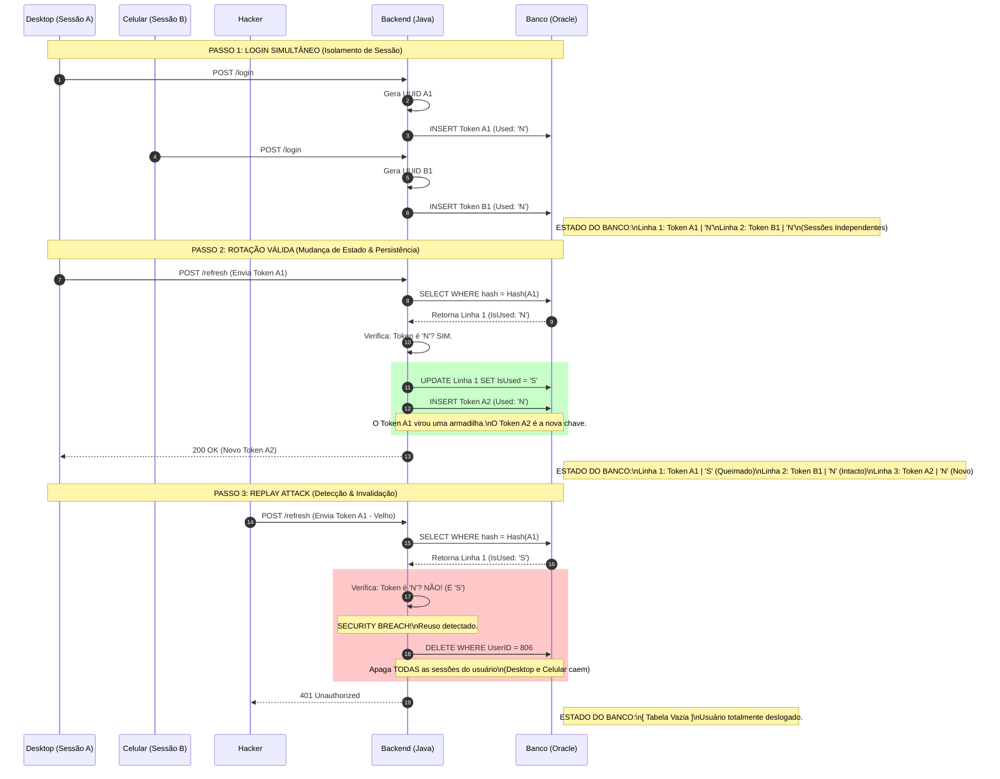

```mermaid
sequenceDiagram
    autonumber
    participant Desktop as Desktop (Sessão A)
    participant Mobile as Celular (Sessão B)
    participant Hacker as Hacker
    participant API as Backend (Java)
    participant DB as Banco (Oracle)

    note over Desktop, DB: PASSO 1: LOGIN SIMULTÂNEO (Isolamento de Sessão)

    Desktop->>API: POST /login
    API->>API: Gera UUID A1
    API->>DB: INSERT Token A1 (Used: 'N')

    Mobile->>API: POST /login
    API->>API: Gera UUID B1
    API->>DB: INSERT Token B1 (Used: 'N')

    Note right of DB: ESTADO DO BANCO:\nLinha 1: Token A1 | 'N'\nLinha 2: Token B1 | 'N'\n(Sessões Independentes)

    note over Desktop, DB: PASSO 2: ROTAÇÃO VÁLIDA (Mudança de Estado & Persistência)

    Desktop->>API: POST /refresh (Envia Token A1)
    API->>DB: SELECT WHERE hash = Hash(A1)
    DB-->>API: Retorna Linha 1 (IsUsed: 'N')

    API->>API: Verifica: Token é 'N'? SIM.

    rect rgb(200,255,200)
        API->>DB: UPDATE Linha 1 SET IsUsed = 'S'
        API->>DB: INSERT Token A2 (Used: 'N')
        Note over API, DB: O Token A1 virou uma armadilha.\nO Token A2 é a nova chave.
    end

    API-->>Desktop: 200 OK (Novo Token A2)

    Note right of DB: ESTADO DO BANCO:\nLinha 1: Token A1 | 'S' (Queimado)\nLinha 2: Token B1 | 'N' (Intacto)\nLinha 3: Token A2 | 'N' (Novo)

    note over Desktop, DB: PASSO 3: REPLAY ATTACK (Detecção & Invalidação)

    Hacker->>API: POST /refresh (Envia Token A1 - Velho)
    API->>DB: SELECT WHERE hash = Hash(A1)
    DB-->>API: Retorna Linha 1 (IsUsed: 'S')

    rect rgb(255,200,200)
        API->>API: Verifica: Token é 'N'? NÃO! (É 'S')
        Note over API: SECURITY BREACH!\nReuso detectado.

        API->>DB: DELETE WHERE UserID = 806
        Note over API, DB: Apaga TODAS as sessões do usuário\n(Desktop e Celular caem)
    end

    API-->>Hacker: 401 Unauthorized

    Note right of DB: ESTADO DO BANCO:\n[ Tabela Vazia ]\nUsuário totalmente deslogado.
```
